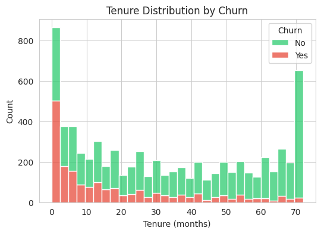
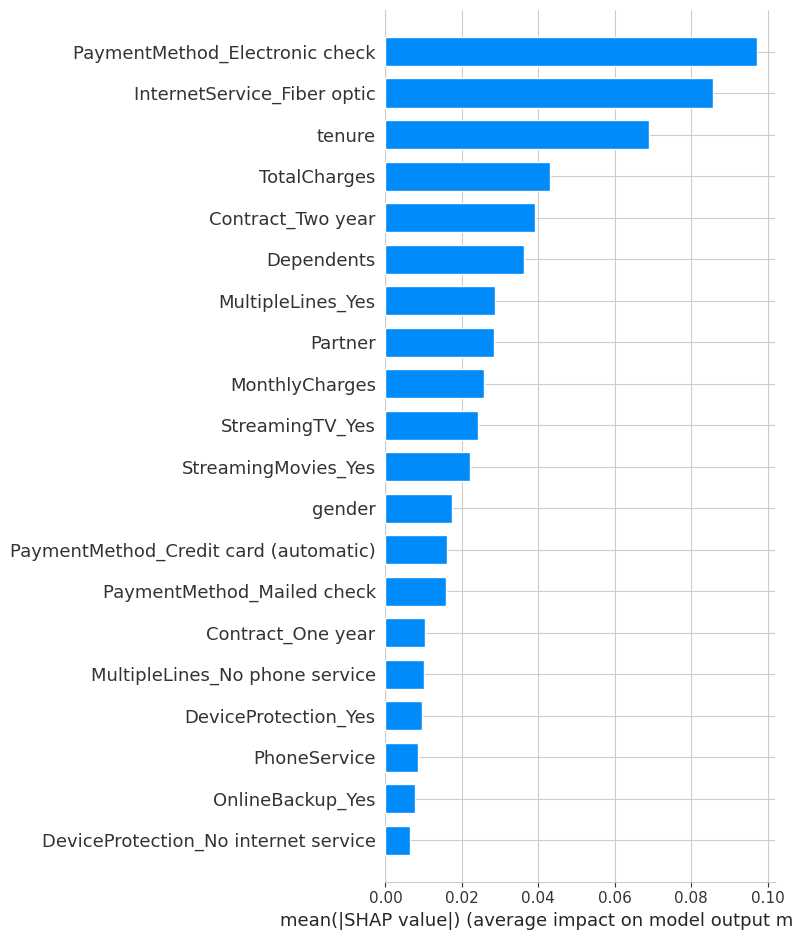

# Customer Churn Prediction

Predicting customer churn for a telecom company using machine learning, 
with a focus on interpretability and actionable business insights.

## 📊 Problem Statement
Customer churn is expensive — acquiring a new customer costs significantly 
more than retaining an existing one. This project builds a model to identify 
customers at high risk of churning, so a business can intervene proactively.

## 🗂️ Dataset
- **Source:** [Telco Customer Churn (Kaggle)](https://www.kaggle.com/datasets/blastchar/telco-customer-churn)
- 7,043 customers, 21 features (demographics, account info, services subscribed)
- Target: `Churn` (Yes/No)

## 🔍 Key Insights (EDA)
- Churn rate: 26.5% — moderately imbalanced dataset, handled with SMOTE
- **Tenure** is the strongest churn driver — new customers (<12 months) churn far more than long-tenured ones
- **Month-to-month contracts** have dramatically higher churn than 1-2 year contracts
- Churners tend to have **higher monthly charges** ($70-100 range)
- 

## 🛠️ Approach
1. Data cleaning (fixed `TotalCharges` type issue, handled missing values)
2. EDA to identify churn patterns
3. Feature engineering (encoding categorical variables)
4. Handled class imbalance using **SMOTE** (applied only to training data, to avoid data leakage)
5. Trained and compared 3 models: Logistic Regression, Random Forest, XGBoost
6. Model explainability using **SHAP** to identify top churn drivers

## 📈 Results

| Model | Precision (Churn) | Recall (Churn) | ROC-AUC |
|---|---|---|---|
| Logistic Regression | 0.52 | 0.64 | 0.808 |
| **Random Forest (final model)** | 0.56 | 0.58 | **0.815** |
| XGBoost | 0.56 | 0.58 | 0.808 |

Random Forest was selected as the final model for its best overall ROC-AUC. 
Note: Logistic Regression had higher recall, which may be preferable in 
contexts where catching more churners outweighs precision — a business 
tradeoff worth discussing with stakeholders.

## 🔑 Top Churn Drivers (via SHAP)
1. Tenure
2. Total Charges
3. Two-year contract
4. Dependents
5. Multiple lines
6. 

## 💡 Business Recommendations
- Focus retention efforts on customers in their **first 12 months**
- Offer incentives to shift month-to-month customers toward annual contracts
- Investigate pricing/value perception for customers with high monthly charges

## 🧰 Tech Stack
Python · Pandas · Scikit-learn · XGBoost · SHAP · Imbalanced-learn · Matplotlib/Seaborn

## 🚀 How to Run
1. Clone this repo
2. `pip install -r requirements.txt`
3. Open `churn_prediction.ipynb` in Jupyter or Google Colab and run all cells
